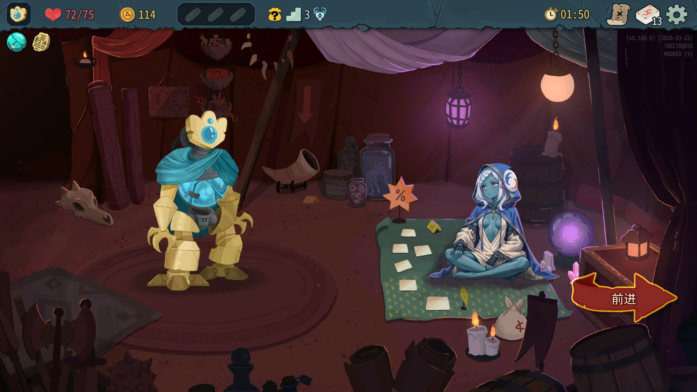
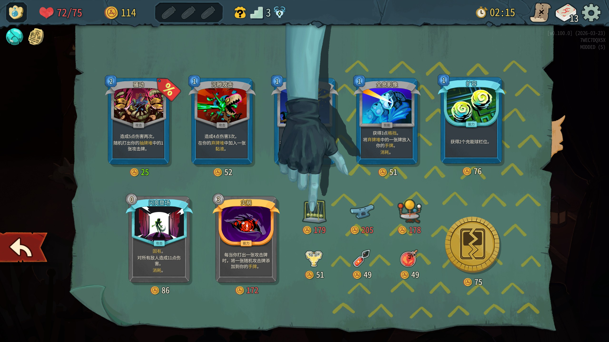

# [STS2 mod] 商人娘化mod

本项目的贴图基于AI生成并进行了部分修改。

动画使用了序列帧，导致包体有些大。

# mod使用方法

1. 下载 [Releases](https://github.com/LinXce/merchant-2-cute/releases) 的Merchant2Cute压缩包 解压到杀戮尖塔2游戏目录下的mods文件夹。
2. 如果没有mods文件夹可以手动创建。
3. 请注意使用正确的版本，杀戮尖塔2的正式版本和beta版本不一样，如果图方便直接下载pe版本（没有dll文件，pc和pe都能用）

## v1.0.3-beta

4.10:修复了新的beta测试版本mod报错的问题

## v1.0.3

更新了污浊药水的特殊效果，会腐蚀小部分衣物。
（动画效果有点差请见谅）
之后会考虑换个画风

## v1.0.2

添加了手机端适配，不再需要dll文件，但未进行有效测试。

## v1.0.1

- 修改了商人的动画以及手部纹理

> 目前没做假商人，动画太多了。
>
> 第一次做mod，闲的没事学着玩的，希望能给想做STS2mod的人提供部分参考。（虽然我也是新人>3）

### 关于手部替换

当然我是指根据网友的意见说的足部版本，有点不太想把图片贴到readme（把几张脚的图片贴在这有点太怪了），总之有需求的自行下载看效果吧。
